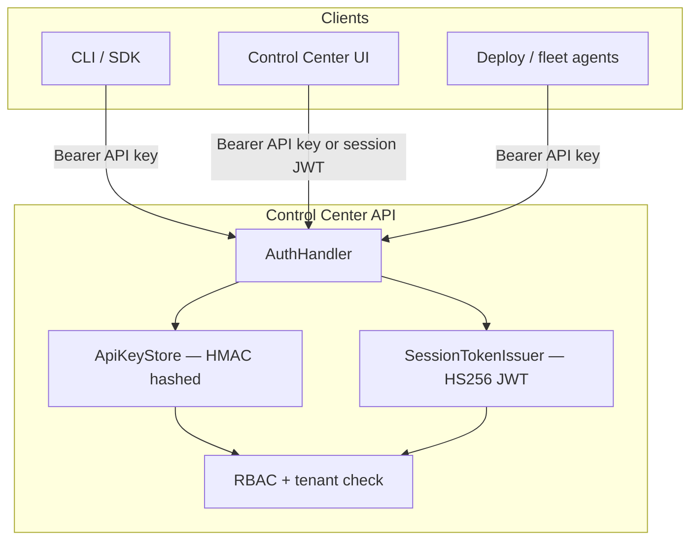

# Control Center authentication

Spanda Control Center uses a unified **Bearer** authentication model at the REST and gRPC
boundary. Operators present either:

1. **Long-lived API keys** — for automation, SDK clients, and local dev
2. **Short-lived session JWTs** — for browser SSO after OIDC sign-in

Both map to the same **RBAC** roles and tenant isolation rules.

## Architecture



**Core crate:** `spanda-security` — `AuthHandler`, `ApiKeyStore`, `SessionTokenIssuer`,
`ReadAuthPolicy`.

## API keys (long-lived)

### Format

```http
Authorization: Bearer <token>
```

gRPC accepts the same value in `authorization` metadata or `x-api-key`.

### Storage

| Source | On disk | In memory |
|--------|---------|-----------|
| `SPANDA_API_KEY` | Not persisted | Plaintext (dev convenience) |
| `SPANDA_API_KEYS_FILE` / `.spanda/api-keys.json` | **`token_hash` only** (HMAC-SHA256) | Hash only after create/load |
| Admin `POST /v1/admin/api-keys` | Hash persisted; plaintext returned once | Hash only |

Legacy `api-keys.json` files with a plaintext `token` field are **migrated on load** — the
server hashes the token and clears plaintext from memory. The next `persist_file_keys` write
stores hashes only.

### Pepper

Set a production pepper so key hashes are not portable across instances:

```bash
export SPANDA_API_KEY_PEPPER="$(openssl rand -hex 32)"
export SPANDA_SESSION_JWT_SECRET="$(openssl rand -hex 32)"   # recommended separate secret
```

When unset, the pepper falls back to `SPANDA_CONTROL_CENTER_STATE_DIR` (or `.spanda`). Use
explicit secrets in production.

### Generate keys

```bash
spanda control-center api-key generate --export
# or
export SPANDA_API_KEY="my-local-dev-key"
spanda control-center serve
```

See [control-center.md](./control-center.md#authentication--api-keys) for multi-key JSON and
roles.

## Session JWTs (short-lived, OIDC)

After OIDC sign-in, the server issues an **HS256 JWT** usable as `Authorization: Bearer <jwt>`.

| Variable | Default | Purpose |
|----------|---------|---------|
| `SPANDA_SESSION_JWT_SECRET` | falls back to pepper | JWT signing key |
| `SPANDA_SESSION_JWT_ISSUER` | `spanda-control-center` | `iss` claim |
| `SPANDA_SESSION_TTL_SECS` | `900` (15 min) | Access token lifetime |
| `SPANDA_SESSION_REFRESH_WINDOW_SECS` | `86400` | Refresh allowed after expiry |

### Claims

| Claim | Meaning |
|-------|---------|
| `sub` | Operator user id (OIDC `sub`) |
| `key_id` | `session-<user_id>` |
| `role` | RBAC role (from IdP group map or directory) |
| `tenant_id` | Instance tenant |
| `exp` / `iat` | Standard JWT timestamps |
| `iss` | `spanda-control-center` (configurable) |

### OIDC setup

1. **Administration → OIDC / SSO** — configure issuer, client id/secret, group→role map, redirect URI
2. Enable integration (`enabled: true` on `PUT /v1/admin/oidc`)
3. Operators use **Sign in with SSO** in the Control Center UI, or call the public auth routes below

Redirect callback page: `/admin/oauth/oidc/callback` (PKCE, posts message to opener).

### Auth routes

| Method | Path | Auth | Description |
|--------|------|------|-------------|
| `GET` | `/v1/auth/config` | No | OIDC login availability, session TTL, read-auth flags |
| `GET` | `/v1/auth/session` | Bearer | Current principal (`auth_kind`, `user_id`, role) |
| `POST` | `/v1/auth/session/refresh` | Body `{ "token": "<jwt>" }` | Refresh near-expired session |
| `POST` | `/v1/auth/oidc/authorize-url` | No | Build IdP authorize URL (requires OIDC enabled) |
| `POST` | `/v1/auth/oidc/callback` | No | Exchange code → `session_token` + directory import |

Admin directory import (requires existing Deploy token): `POST /v1/admin/oidc/oauth/callback` —
also returns `session_token` when userinfo is present.

### Example: OIDC login (curl)

```bash
# 1. Get authorize URL (browser opens authorize_url)
curl -s -X POST http://127.0.0.1:8080/v1/auth/oidc/authorize-url \
  -H 'Content-Type: application/json' \
  -d '{"redirect_uri":"http://127.0.0.1:8080/admin/oauth/oidc/callback"}'

# 2. After IdP redirect, exchange code
curl -s -X POST http://127.0.0.1:8080/v1/auth/oidc/callback \
  -H 'Content-Type: application/json' \
  -d '{"code":"<code>","state":"<state>"}'

# 3. Use session_token as Bearer on mutations and sensitive reads
export SPANDA_API_KEY="<session_token>"
```

## RBAC and tenants

Unchanged from prior releases — see [control-center.md](./control-center.md#authentication--api-keys).

- Mutations (`POST` / `PATCH` / `PUT` / `DELETE`) require a valid Bearer principal with the
  matching role action.
- `SPANDA_TENANT_ID` on the instance must match the key or session `tenant_id`.

`GET /v1/rbac/me` returns `auth_kind` (`api_key` | `session`) and `user_id` for sessions.

## Optional read authentication

By default, `GET /v1/*` remains open except endpoints that already required Bearer (secrets,
audit, `rbac/me`, etc.).

Enable stricter policies for network-exposed Control Center instances:

| Variable | Effect |
|----------|--------|
| `SPANDA_API_REQUIRE_AUTH_READS=1` | Sensitive GET prefixes require Bearer (dashboard, devices, fleet, program source, compliance, …) |
| `SPANDA_API_REQUIRE_AUTH_ALL_READS=1` | All GETs require Bearer except `/v1/health`, `/v1/version`, `/v1/instance`, `/v1/tenant` |

Failed read-auth returns **401** and records `AuthFailed` with reason `read_auth_required`.

## What is not JWT/OAuth

| Concern | Mechanism |
|---------|-----------|
| Robot / fleet wire security | mTLS, signed messages — [secure-communication.md](./secure-communication.md) |
| OTLP push | `SPANDA_OTLP_TOKEN` Bearer |
| Twin Cloud | `SPANDA_TWIN_CLOUD_API_KEY` |
| OIDC code exchange | Used only to obtain IdP userinfo and issue **Spanda session JWTs** — IdP access tokens are not accepted as Control Center API credentials |

## Security checklist (production)

1. Set `SPANDA_API_KEY_PEPPER` and `SPANDA_SESSION_JWT_SECRET` to unique random values.
2. Terminate TLS at ingress; do not bind Control Center to the public internet without TLS.
3. Enable `SPANDA_API_REQUIRE_AUTH_READS=1` (or `ALL_READS`) when the API is reachable beyond localhost.
4. Restrict file permissions on `.spanda/api-keys.json` and state directory.
5. Rotate API keys on compromise; session JWTs expire automatically.
6. Run `./scripts/security_audit_prep.sh` before third-party review —
   [security-audit-third-party.md](./security-audit-third-party.md).

## Related

- [control-center.md](./control-center.md) — operator workflows, API key CRUD
- [security-architecture.md](./security-architecture.md) — runtime / robot security boundary
- [sdk.md](./sdk.md) — client Bearer configuration
- [control-center-rate-limits.md](./control-center-rate-limits.md) — per-key rate limits
