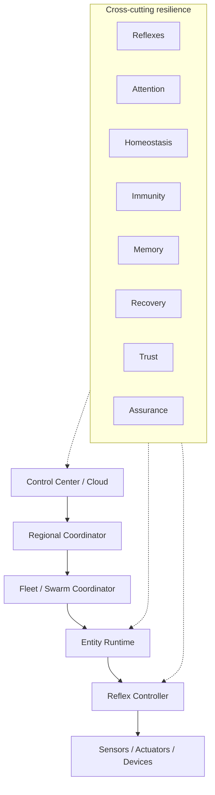

# Bio-Inspired Resilient Autonomy Architecture

Spanda uses a **hierarchical, resilient autonomy architecture** inspired by proven principles from biological nervous systems: local reflexes, distributed control, sensory fusion, system homeostasis, adaptive recovery, platform immunity, and operational memory. The goal is **not** to imitate biology, but to apply these proven resilience patterns to safety-critical autonomous systems.

> **Caution:** Spanda does not attempt to model consciousness, emotions, biological neurons, or artificial life. Biological metaphors are used only where they improve engineering resilience, safety, recovery, and explainability.

This architecture **extends** the existing [Distributed Decision Architecture](./distributed-decisions.md) — it does not replace it.

---

## Platform description

Spanda is a **safety-first Autonomous Systems Platform** with a dedicated programming language at its core. It provides readiness, assurance, diagnosis, recovery, trust, and distributed autonomy for robots, devices, AI agents, humans, and intelligent environments.

---

## Architecture diagram



**Hierarchy (peripheral autonomy):**

```text
Control Center / Cloud
        ↓
Regional Coordinator
        ↓
Fleet / Swarm Coordinator
        ↓
Entity Runtime
        ↓
Reflex Controller
        ↓
Sensors / Actuators / Devices
```

---

## Concepts

| Concept | Purpose | Status | Guide |
|---------|---------|--------|-------|
| Reflex Arc | Immediate local safety response | **Beta** | [reflex-architecture.md](./reflex-architecture.md) |
| Peripheral Autonomy | Avoid over-centralization | **Beta** | [peripheral-autonomy.md](./peripheral-autonomy.md) |
| Sensory Fusion | Multi-source confidence | **Experimental** | [sensory-fusion.md](./sensory-fusion.md) |
| Confidence Model | Conflict detection and fallback | **Experimental** | [confidence-model.md](./confidence-model.md) |
| Attention System | Event prioritization | **Preview** | [attention-system.md](./attention-system.md) |
| Homeostasis | Safe operating range | **Preview** | [homeostasis.md](./homeostasis.md) |
| Platform Immunity | Quarantine untrusted entities | **Beta** | [platform-immunity.md](./platform-immunity.md) |
| Operational Memory | Engineering memory categories | **Preview** | [operational-memory.md](./operational-memory.md) |
| Habituation / Sensitization | Alert fatigue management | **Experimental** | [habituation-sensitization.md](./habituation-sensitization.md) |
| Damage-Risk Model | Harm potential, not just errors | **Preview** | [damage-risk-model.md](./damage-risk-model.md) |
| Adaptive Recovery | Rule-based strategy learning | **Experimental** | [adaptive-recovery.md](./adaptive-recovery.md) |
| Maintenance / Sleep Mode | Low-risk maintenance windows | **Preview** | [maintenance-mode.md](./maintenance-mode.md) |

---

## Entity integration

Every concept attaches to the unified [Entity model](./entity-model.md) via `EntityAutonomyProfile`:

- `Entity.reflexes` — registered reflex summaries
- `Entity.confidence` — fused observation confidence
- `Entity.homeostasis` — stability snapshot
- `Entity.immunity_status` — quarantine state
- `Entity.memory_refs` — operational memory references
- `Entity.damage_risk` — harm-risk index
- `Entity.recovery_confidence` — adaptive recovery score

REST: `GET /v1/entities/{id}/autonomy`

---

## CLI

| Command | Description |
|---------|-------------|
| `spanda reflex list` | List platform reflex actions |
| `spanda reflex simulate [hint]` | Simulate reflex selection |
| `spanda reflex trace [hint]` | Emit reflex trace |
| `spanda fusion check` | Run sensory fusion demo |
| `spanda confidence report` | Confidence and conflict report |
| `spanda homeostasis check` | Evaluate stability metrics |
| `spanda homeostasis report` | Full homeostasis report |
| `spanda immunity scan` | Scan entities for immunity events |
| `spanda immunity quarantine [id]` | Quarantine decision for entity |
| `spanda alerts analyze` | Habituation / sensitization analysis |
| `spanda alerts fatigue-report` | Alert fatigue metrics |
| `spanda recovery confidence` | Recovery confidence from history |
| `spanda recovery learning-report` | Strategy preference report |

---

## Crate

Implementation lives in **`spanda-autonomy`** (`crates/spanda-autonomy/`).

---

## Known limitations

See [known-limitations.md](./known-limitations.md#bio-inspired-resilient-autonomy). Sensory fusion and attention remain rule-based; adaptive recovery uses statistics, not ML. Live reflex traces are buffered in-process during `run`/`sim` and exposed via REST when the API server shares the process.

**Smoke:** `./scripts/bio_inspired_autonomy_smoke.sh`

**AST preview:** `homeostasis_policy` and `attention_policy` declaration slots exist on `Program` for future `.sd` syntax; parser keywords are not wired yet.

---

## Related

- [Distributed decisions](./distributed-decisions.md) — brain / spinal cord / reflex layers (**Stable**)
- [Platform architecture](./platform-architecture.md)
- [Recovery orchestrator](./recovery-orchestrator.md)
- [Entity model](./entity-model.md)
