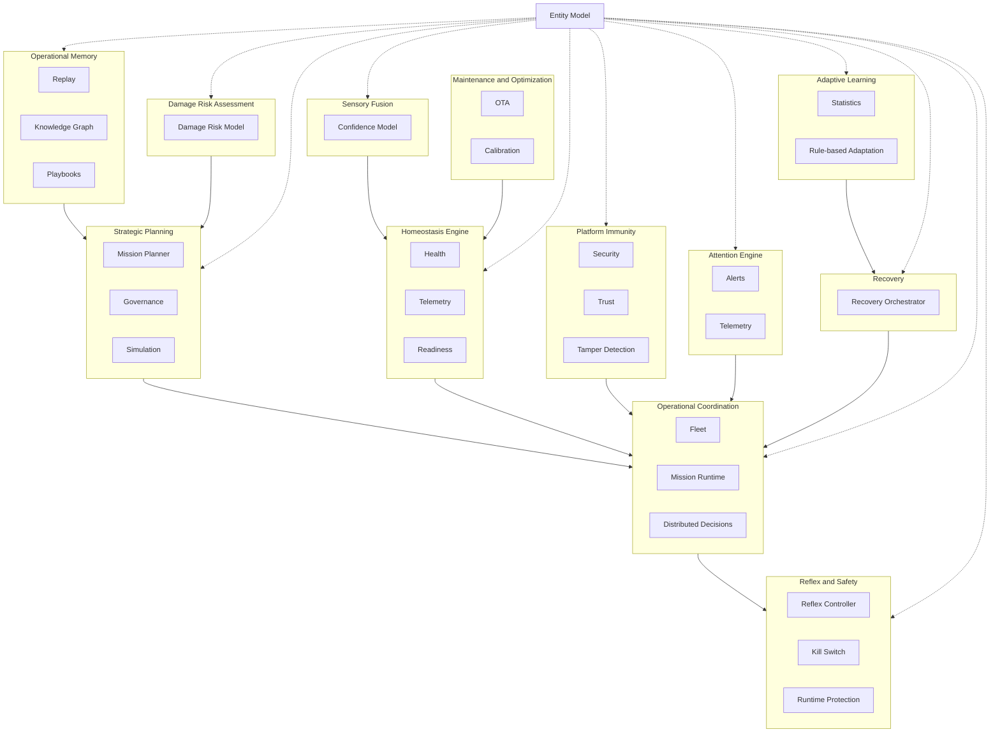

# Spanda Cognitive & Resilience Architecture

Spanda implements a **Cognitive & Resilience Architecture** — a functional view of platform responsibilities inspired by proven engineering principles observed in biological nervous systems. Rather than replicating biological anatomy, Spanda adopts functional concepts such as local reflexes, distributed coordination, sensory fusion, homeostasis, platform immunity, operational memory, adaptive recovery, and attention management to improve safety, resilience, and explainability.

> **Important:** Spanda is **not** a biologically inspired AI platform and does not attempt to model consciousness, emotions, or neural structures. Biological concepts are used only where they provide measurable engineering benefits. Implementation modules are **not** named after brain anatomy (no Cortex, Cerebellum, Hippocampus, etc.).

This architecture **sits alongside** existing views — it does not replace them:

| Architectural view | Focus |
|--------------------|-------|
| [Platform Architecture](./platform-architecture.md) | Layered crate structure, dependency governance |
| [Entity Architecture](./entity-model.md) | Unified `Entity` model and graph |
| [Runtime Architecture](./architecture.md) | Compiler pipeline, interpreter, scheduler |
| [Distributed Decision Architecture](./distributed-decisions.md) | Reflex / local / fleet / control-center layers |
| [Recovery Architecture](./recovery-orchestrator.md) | Plan, simulate, execute, audit recovery |
| **Cognitive & Resilience Architecture** (this document) | Functional responsibility domains |

**Implementation crate:** `spanda-autonomy` — wraps and integrates existing platform services; does not duplicate them.

---

## Platform description

**Spanda is a safety-first Autonomous Systems Platform with a dedicated programming language at its core.** It orchestrates robots, devices, AI agents, vehicles, humans, and intelligent environments using a unified Entity Model and built-in capabilities for readiness, assurance, recovery, trust, health, distributed autonomy, and governance.

---

## Architecture diagram



**Peripheral autonomy hierarchy** (unchanged from distributed decisions):

```text
Control Center / Cloud
        ↓
Regional Coordinator
        ↓
Fleet / Swarm Coordinator
        ↓
Entity Runtime
        ↓
Reflex Controller
        ↓
Sensors / Actuators / Devices
```

---

## Functional domains

Eleven functional responsibility domains organize platform capabilities. Full definitions: [functional-domains.md](./functional-domains.md).

| Domain | Primary responsibility | Status |
|--------|------------------------|--------|
| [Strategic Planning](./functional-domains.md#strategic-planning) | Mission planning, policy, governance, deployment | **Stable** (mission planner, governance) |
| [Operational Coordination](./functional-domains.md#operational-coordination) | Fleet, scheduling, delegation, takeover | **Stable** |
| [Reflex & Safety](./functional-domains.md#reflex--safety) | Emergency stop, kill switch, local safety | **Beta** |
| [Homeostasis Engine](./platform-homeostasis.md) | Stable operating conditions | **Beta** |
| [Platform Immunity](./platform-immunity.md) | Quarantine, isolation, re-admission | **Beta** |
| [Sensory Fusion](./sensory-fusion.md) | Multi-source confidence | **Experimental** |
| [Attention Engine](./attention-engine.md) | Event prioritization, alert fatigue | **Beta** |
| [Operational Memory](./operational-memory.md) | Mission state, replay, playbooks | **Preview** |
| [Adaptive Learning](./adaptive-operations.md) | Rule-based outcome learning | **Experimental** |
| [Damage Risk Assessment](./damage-risk.md) | Harm potential modeling | **Beta** |
| [Maintenance & Optimization](./functional-domains.md#maintenance--optimization) | OTA, calibration, cleanup | **Stable** (OTA) / **Preview** (sleep mode) |

---

## Entity integration

Every functional domain operates on **Entity** objects. Domain state attaches via `Entity.autonomy` (`EntityAutonomyProfile`):

| Entity field | Functional domain |
|--------------|-------------------|
| `Entity.health` | Homeostasis Engine (via `health_status`) |
| `Entity.homeostasis` | Homeostasis Engine |
| `Entity.readiness` | Homeostasis Engine, Sensory Fusion |
| `Entity.trust` | Platform Immunity |
| `Entity.immunity` (`immunity_status`) | Platform Immunity |
| `Entity.confidence` | Sensory Fusion |
| `Entity.reflexes` | Reflex & Safety |
| `Entity.attention` | Attention Engine |
| `Entity.operationalMemory` (`memory_refs`) | Operational Memory |
| `Entity.damageRisk` (`damage_risk`) | Damage Risk Assessment |
| `Entity.recoveryConfidence` | Adaptive Learning, Recovery |

REST: `GET /v1/entities/{id}/autonomy` — enriched profile with all domain snapshots.

---

## Responsibility matrix

Capability-to-domain mapping prevents service overlap: [responsibility-matrix.md](./responsibility-matrix.md).

---

## SDK and API

Domain clients wrap existing REST endpoints — no duplicate business logic:

| Client | REST prefix | Guide |
|--------|-------------|-------|
| `ReflexClient` | `/v1/autonomy/reflex` | [reflex-architecture.md](./reflex-architecture.md) |
| `HomeostasisClient` | `/v1/autonomy/homeostasis` | [platform-homeostasis.md](./platform-homeostasis.md) |
| `ImmunityClient` | `/v1/autonomy/immunity` | [platform-immunity.md](./platform-immunity.md) |
| `AttentionClient` | `/v1/autonomy/attention` | [attention-engine.md](./attention-engine.md) |
| `FusionClient` | `/v1/autonomy/fusion` | [sensory-fusion.md](./sensory-fusion.md) |
| `MemoryClient` | `/v1/autonomy/memory` | [operational-memory.md](./operational-memory.md) |
| `RiskClient` | `/v1/risk`, entity `damage_risk` | [damage-risk.md](./damage-risk.md) |

`AutonomyClient` remains as a backward-compatible facade. See [entity-sdk.md](./entity-sdk.md).

gRPC parity (proto **1.0.14+**): `ListAutonomyReflexes`, `GetAutonomyHomeostasis`, `GetAutonomyImmunity`, `GetAutonomyAttention`, `GetAutonomyFusion`, `GetAutonomyMemory`, `GetEntityAutonomy`.

---

## Control Center

The **Cognitive & Resilience** tab organizes live panels by functional domain: Strategic Planning summary, Reflex Events, Attention Queue, Homeostasis, Platform Immunity, Operational Memory, Damage Risk, Recovery Confidence. See [control-center.md](./control-center.md).

---

## CLI

| Command | Domain |
|---------|--------|
| `spanda reflex list\|simulate\|trace` | Reflex & Safety |
| `spanda homeostasis check\|report` | Homeostasis Engine |
| `spanda immunity scan\|quarantine\|report` | Platform Immunity |
| `spanda fusion check` | Sensory Fusion |
| `spanda confidence report` | Sensory Fusion |
| `spanda alerts analyze\|fatigue-report` | Attention Engine |
| `spanda recovery confidence\|learning-report` | Adaptive Learning |

---

## Migration

Existing [bio-inspired-architecture.md](./bio-inspired-architecture.md) content is preserved. The Cognitive & Resilience Architecture is the **canonical functional view** going forward. See [cognitive-resilience-migration.md](./cognitive-resilience-migration.md).

---

## Related

- [functional-domains.md](./functional-domains.md) — domain definitions
- [responsibility-matrix.md](./responsibility-matrix.md) — capability ownership
- [bio-inspired-architecture.md](./bio-inspired-architecture.md) — prior naming (redirects here)
- [distributed-decisions.md](./distributed-decisions.md) — decision layer model
- [entity-model.md](./entity-model.md) — unified Entity
