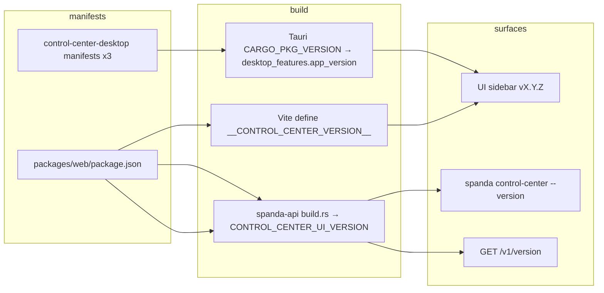

# Control Center versioning

How Control Center semver is defined, displayed, bumped, and released. Spanda uses **independent
release streams** — Control Center desktop and UI versioning is separate from workspace CLI and
official SDKs. Policy overview: [versioning.md](./versioning.md).

**Current desktop release:** **0.6.3** — tag
[`desktop-v0.6.3`](https://github.com/Davalgi/Spanda/releases/tag/desktop-v0.6.3).

---

## Two version numbers operators see

| Name | Source | When it applies |
|------|--------|-----------------|
| **Control Center UI version** | `packages/web/package.json` (injected at Vite build; compiled into `spanda-api` via `build.rs`) | Sidebar label, CLI `--version`, `GET /v1/version` → `control_center_ui_version` |
| **Desktop shell version** | `packages/control-center-desktop` Tauri manifests (`CARGO_PKG_VERSION`) | Tauri desktop app; exposed to the webview as `desktop_features.app_version` |

In normal releases these are kept aligned (both **0.6.3** today). They can diverge by stream policy
— for example a workspace-only bump updates `packages/web` while desktop stays on an older Tauri
line until the next `desktop-v*` release.

**Platform version:** `GET /v1/version` also returns `spanda_version` (workspace `spanda-api` crate
semver). That is the Spanda platform/API build, not the Control Center product label shown in the UI
sidebar.

---

## Where the version appears

### UI

- **Sidebar** — under the “Control Center” title: `vX.Y.Z`
- **Tauri desktop** — reads `app_version` from the Tauri command `desktop_features` (desktop shell
  semver)
- **Browser / embedded UI** — build-time constant from `packages/web` (`__CONTROL_CENTER_VERSION__`)

Implementation: `packages/web/src/controlCenterVersion.ts`, `useControlCenterVersion.ts`,
`ControlCenterPanel.tsx`.

### CLI

```bash
spanda control-center --version
# spanda control-center 0.6.3

spanda control-center status
# …
#   UI version:    0.6.3

spanda control-center serve --bind 127.0.0.1:8080
# Spanda Control Center v0.6.3 listening on http://127.0.0.1:8080
```

### REST API

**`GET /v1/version`**

| Field | Meaning |
|-------|---------|
| `control_center_ui_version` | Control Center UI semver |
| `spanda_version` | Workspace platform (`spanda-api`) semver |
| `version` | REST API path prefix (`v1`) |
| `api_version` | Supported API version header value |
| `grpc` | Proto semver and RPC metadata |

**`GET /v1/instance`** — runtime status for operators and `spanda control-center status`; includes
`control_center_ui_version` and `spanda_version`.

---

## Release stream: desktop

| Manifest | Path |
|----------|------|
| npm | `packages/control-center-desktop/package.json` → `"version"` |
| Cargo | `packages/control-center-desktop/src-tauri/Cargo.toml` → `version` |
| Tauri | `packages/control-center-desktop/src-tauri/tauri.conf.json` → `"version"` |

**Tag:** `desktop-vX.Y.Z` →
[.github/workflows/desktop-release.yml](../.github/workflows/desktop-release.yml) (macOS `.dmg` /
`.app.tar.gz` GitHub Release + workflow artifacts).

**Pre-flight:**

```bash
./scripts/verify_desktop_release_ready.sh
```

Fails on manifest mismatch; runs `control_center_desktop_smoke.sh` (`cargo check` on the Tauri
crate).

### When to bump (semver component)

| Component | Increment when |
|-----------|----------------|
| **Patch** | Desktop UI fixes, Tauri wiring, packaging polish |
| **Minor** | New Control Center tabs, substantial UI features, desktop integrations |
| **Major** | Breaking desktop install/upgrade path |

Bump command:

```bash
python3 scripts/bump_version.py patch --stream desktop --dry-run
python3 scripts/bump_version.py minor --stream desktop
```

---

## Automatic desktop bump (CI)

After **CI Integration** succeeds on `main`,
[.github/workflows/auto-release.yml](../.github/workflows/auto-release.yml):

1. Reads **`release:major`**, **`release:minor`**, or **`release:patch`** from the **merged** PR
   (same labels as workspace auto release).
2. Bumps **workspace** → commits `chore: release vX.Y.Z` → pushes tag **`vX.Y.Z`**.
3. If the merged PR changed **Control Center paths**, bumps **desktop** with the **same semver
   component** → commits `chore: release desktop vX.Y.Z` → pushes tag **`desktop-vX.Y.Z`**.

Path detection (also available locally):

```bash
./scripts/control_center_paths_changed.sh origin/main
echo $?   # 0 = Control Center paths changed
```

Monitored paths:

| Path | Area |
|------|------|
| `packages/control-center-desktop/**` | Tauri shell |
| `packages/web/**` | React Control Center UI |
| `crates/spanda-api/src/control_center*` | Embedded UI + API wiring |
| `crates/spanda-api/src/static/control-center-ui/**` | Synced embedded assets |
| `crates/spanda-cli/src/control_center*` | Control Center CLI |
| `scripts/sync_control_center_embedded_ui.sh` | UI sync into API |
| `scripts/control_center_*` | Desktop / CC scripts |
| `scripts/verify_desktop_release_ready.sh` | Release gate |

**Manual ad-hoc bump:** Actions → **Bump version** → choose stream **desktop** or **workspace**;
optional tag push. Uses [.github/workflows/release-bump.yml](../.github/workflows/release-bump.yml).

**Skip loop:** Auto release skips when the merge commit message is already `chore: release v*` or
`chore: release desktop v*`.

---

## Manual release checklist

1. Identify whether the change is workspace, desktop, or both ([versioning.md](./versioning.md)).
2. For desktop-only changes without a labeled PR:
   ```bash
   python3 scripts/bump_version.py minor --stream desktop
   ./scripts/verify_desktop_release_ready.sh
   git add packages/control-center-desktop/
   git commit -m "chore: release desktop v0.6.4"
   git tag desktop-v0.6.4 && git push origin main desktop-v0.6.4
   ```
3. Watch **Actions → Desktop Control Center release**.
4. Update [CHANGELOG.md](../CHANGELOG.md) under `[Unreleased]` when user-visible.

For embedded UI changes served by `spanda control-center serve`, rebuild and sync assets after UI
edits:

```bash
./scripts/sync_control_center_embedded_ui.sh
```

The UI semver in the API comes from `packages/web/package.json` at `spanda-api` compile time
(`crates/spanda-api/build.rs`).

---

## Architecture (build pipeline)



| Layer | Package | Version source |
|-------|---------|----------------|
| React UI | `@davalgi-spanda/web` | `packages/web` semver |
| Embedded UI in API | `crates/spanda-api` static assets | Same as `packages/web` at compile time |
| Desktop shell | `@spanda/control-center-desktop` | Desktop stream (three synced manifests) |
| API server | `spanda control-center serve` | Platform workspace semver + UI version fields above |

---

## Troubleshooting

| Symptom | Cause | Fix |
|---------|-------|-----|
| Sidebar shows `vdev` | Dev server without Vite define | Use `npm run control-center:desktop:dev` or embedded build; not a production issue |
| `verify_desktop_release_ready.sh` fails | `package.json` / `Cargo.toml` / `tauri.conf.json` mismatch | `python3 scripts/bump_version.py patch --stream desktop` or align manually |
| CLI/API version differs from desktop app | Streams diverged | Expected when only one stream was bumped; bump desktop or reinstall matching release |
| Auto release did not push `desktop-v*` | PR had no `release:*` label or no CC path changes | Add label before merge, or bump desktop manually |
| Embedded UI stale after web edit | Assets not synced | `./scripts/sync_control_center_embedded_ui.sh` and rebuild `spanda` |

---

## Related docs

- [desktop-release-runbook.md](./desktop-release-runbook.md) — macOS bundle, signing, GitHub Release
- [versioning.md](./versioning.md) — all release streams and tags
- [sdk-publishing.md](./sdk-publishing.md) — SDK tags (separate from desktop)
- [CONTRIBUTING.md](../CONTRIBUTING.md#releases) — PR release labels
- [ci-architecture.md](./ci-architecture.md) — CI Integration → Auto release
- [control-center.md](./control-center.md) — API and operator reference
- [packages/control-center-desktop/README.md](../packages/control-center-desktop/README.md) — local
  dev and build
