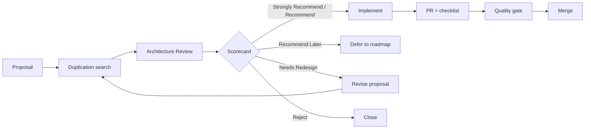

# Design Review Process

How Spanda runs Architecture Review from proposal through merge. This process is **permanent** and
applies to RFCs, ADRs, roadmap items, issues, and pull requests.

**Parent:** [architecture-governance.md](./architecture-governance.md) ·
**Checklist:** [architecture-review-checklist.md](./architecture-review-checklist.md)

---

## Overview

---

## When Review Is Required

Architecture Review is **mandatory** before implementation merge for:

| Change type | Review entry point |
|-------------|-------------------|
| New workspace crate | Architecture proposal issue + ADR |
| New platform service | Architecture proposal issue + ADR |
| New communication layer | Architecture proposal issue + ADR |
| New or breaking API | Architecture proposal issue + ADR |
| New SDK surface (cross-language) | Architecture proposal issue |
| New Control Center feature | Architecture proposal issue |
| New official package (platform-facing) | Package proposal + duplication section |
| New roadmap pillar or platform item | ROADMAP PR with required sections |
| Large refactor crossing layers | ADR + PR checklist |

**Not required** (but checklist still encouraged) for:

- Bug fixes with no API or architecture change
- Documentation typos and clarifications
- Test-only changes
- Internal refactors within one crate preserving public contracts

When uncertain, use the [architecture proposal template](../.github/ISSUE_TEMPLATE/architecture-proposal.md).

---

## Roles

| Role | Responsibility |
|------|----------------|
| **Proposer** | Complete checklist, duplication search, demo/test plan |
| **Architecture reviewer** | Score proposal, enforce non-duplication, recommend outcome |
| **Area owner** | Module owner per [module-ownership.md](./module-ownership.md); approves fit |
| **Security reviewer** | Required for trust, authority, immunity, or new external surface |
| **Maintainer** | Final merge authority after quality gate |

For small PRs, the PR reviewer may act as architecture reviewer if they complete the full checklist.

---

## Process Steps

### 1. Proposal

Open a GitHub issue using [architecture-proposal.md](../.github/ISSUE_TEMPLATE/architecture-proposal.md)
**or** draft an ADR in `docs/adr/` for decisions already agreed offline.

Include all twelve gates from [architecture-review-checklist.md](./architecture-review-checklist.md).

### 2. Duplication search

Proposer completes [non-duplication-policy.md](./non-duplication-policy.md) search obligations and
fills section 3 of the checklist with citations.

### 3. Architecture Review meeting (async default)

Reviewers comment on the issue or ADR with:

- Scorecard dimensions (1–5)
- Overall recommendation
- Required changes before implementation

Sync review is optional for large or contentious proposals.

### 4. Decision outcomes

| Outcome | Next step |
|---------|-----------|
| **Strongly Recommend / Recommend** | Implement; link issue/ADR in PR |
| **Recommend Later** | Add to roadmap with prerequisites; do not implement |
| **Needs Redesign** | Revise to extend existing capability; re-review |
| **Reject** | Close with rationale; archive learnings in ADR if useful |

### 5. Implementation

- Branch from `main`
- Follow [CONTRIBUTING.md](../CONTRIBUTING.md) coding standards
- Add tests and examples per checklist sections 9–10
- Update docs per [documentation-sync](../CONTRIBUTING.md#keeping-documentation-in-sync)

### 6. Pull request

Use [.github/PULL_REQUEST_TEMPLATE.md](../.github/PULL_REQUEST_TEMPLATE.md). Link architecture issue
or ADR. Confirm quality gate items.

### 7. Quality gate (pre-merge)

All items in [architecture-governance.md#quality-gate](./architecture-governance.md#quality-gate)
must be checked. CI must pass ([ci-architecture.md](./ci-architecture.md)).

### 8. Post-merge

- Update [feature-status.md](./feature-status.md) if stability tier changed
- Update [ROADMAP.md](../ROADMAP.md) if milestone completed
- Bump appropriate release stream per [versioning.md](./versioning.md) when releasing

---

## ADR Workflow

Significant decisions are recorded under [docs/adr/](./adr/).

1. Copy [adr/template.md](./adr/template.md) to `docs/adr/NNNN-short-title.md`
2. Set status: Proposed → Accepted / Rejected / Superseded
3. Link from architecture issue and implementing PR
4. Index in [adr/README.md](./adr/README.md)

ADRs are the historical record; issues track active discussion.

---

## Roadmap Integration

New items in [ROADMAP.md](../ROADMAP.md) must include the sections listed in
[architecture-governance.md#roadmap-rule](./architecture-governance.md#roadmap-rule).

Roadmap PRs without these sections should request changes before merge.

---

## RFCs and Design Docs

Large designs may live in `docs/` or a linked gist before an ADR is accepted. RFCs must still pass
the Architecture Review Gate. Accepted RFCs should be summarized or superseded by an ADR.

Naming suggestion: `docs/rfcs/` (optional) for in-progress designs; `docs/adr/` for accepted
decisions.

---

## Escalation

Disagreement between proposer and reviewer:

1. Document alternatives in ADR **Alternatives** and **Rejected Alternatives** sections
2. Request second architecture reviewer
3. Maintainers decide with scorecard and platform vision ([product-strategy.md](./product-strategy.md))

Layer waiver requests follow [dependency-rules.md](./dependency-rules.md) and require architecture
review — waivers are not a bypass for duplication policy.

---

## Integration with Code Review

PR reviewers should verify:

- Architecture issue or ADR linked
- PR template architecture questions answered
- No unchecked quality gate items
- `validate_architecture.py` and relevant CI tiers green

Label suggestion: `architecture-review` on issues and PRs requiring governance attention.

---

## Timeline Expectations

| Proposal size | Target review turnaround |
|---------------|-------------------------|
| Small (extend existing API) | 2–3 business days (async) |
| Medium (new service or crate) | 1 week |
| Large (cross-cutting platform) | 2 weeks + ADR |

Proposers should not begin large implementations before **Recommend** or better.

---

## Success Metrics

The process succeeds when:

- New crates and services decrease relative to package and extension PRs
- ADRs exist for major decisions
- Roadmap items include architecture sections
- Duplicate APIs and models are caught at proposal stage, not after merge
- Contributors cite existing capabilities in PR descriptions habitually
