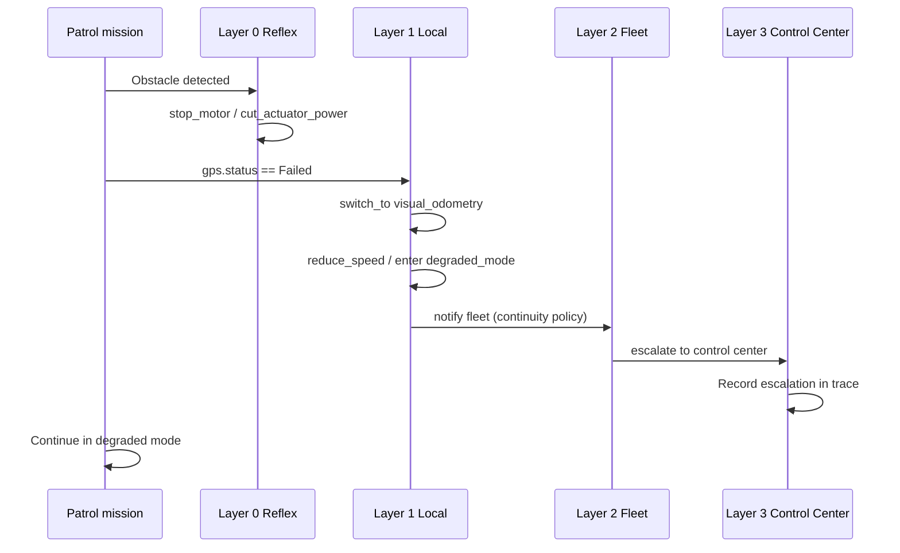

# GPS Loss Recovery — Flagship Distributed Decision Demo

**Duration:** under 10 minutes  
**Audience:** robotics engineers, fleet operators, safety reviewers  
**Message:** When GPS fails mid-mission, Spanda keeps the robot safe at the reflex layer, recovers locally via a signed decision tree, escalates to fleet and Control Center, and leaves a replayable audit trail.

**Status: Stable** — signed trees, persistent escalation, and v3 signed traces.

---

## Quick start

Fastest path from a built CLI:

```bash
export PATH="$PWD/target/release:$PATH"
GPS=examples/showcase/distributed_decisions/gps_loss_recovery/mission.sd

spanda decision list "$GPS"
spanda decision simulate "$GPS" --offline --entity Rover001
export SPANDA_DECISION_TRACE=1
spanda sim "$GPS" --record --inject-health-faults
spanda replay examples/showcase/distributed_decisions/gps_loss_recovery/mission.trace
```

Or run the bundled evaluator path (same GPS mission):

```bash
spanda demo distributed-decisions
```

---

## What you will show

| Step | Command | What the audience sees |
|------|---------|------------------------|
| 1 | Read `mission.sd` | Reflex + local trees, offline bounds, fleet escalation |
| 2 | `spanda decision list` | Layered architecture: `ObstacleReflex` + `GPSLossRecovery` |
| 3 | `spanda decision inspect` | Local authority allows `degraded_mode` when GPS fails and VO is available |
| 4 | `spanda decision simulate --offline` | Offline policy gates high-risk actions while recovery continues |
| 5 | `spanda sim --record --inject-health-faults` | GPS fault injected; decision trace records layer-by-layer outcomes |
| 6 | `spanda replay` + `decision trace` + `audit decisions` | Full v3 trace with rejected alternatives and escalation evidence |
| 7 | `spanda assure` | Assurance case links simulation replay and health evidence |

**Demo path:** `examples/showcase/distributed_decisions/gps_loss_recovery/mission.sd`

---

## Scenario

A warehouse rover runs a patrol mission. GPS fails. The stack responds in layers without blocking reflex safety or waiting for central approval.



1. Robot executes patrol mission.
2. GPS fails (`--inject-health-faults`).
3. **Reflex layer** keeps the robot safe (`ObstacleReflex` tree).
4. **Local layer** switches to visual odometry via `GPSLossRecovery` decision tree.
5. Robot reduces speed and enters degraded mode.
6. **Fleet layer** notified via continuity policy.
7. **Control Center** records escalation (via v3 trace).
8. Readiness recalculated (assurance + diagnostics).
9. Mission continues in degraded mode under signed offline bounds.
10. Replay shows the full decision trace.
11. Assurance report includes recovery evidence.

---

## Step-by-step walkthrough

### 1 — Inspect the decision architecture

```bash
spanda decision list examples/showcase/distributed_decisions/gps_loss_recovery/mission.sd
```

**Expected:** two decision trees (`ObstacleReflex` reflex, `GPSLossRecovery` local) and one offline policy (`RoverOffline`, 30 min max).

```bash
spanda decision inspect examples/showcase/distributed_decisions/gps_loss_recovery/mission.sd \
  --entity Rover001 --action degraded_mode \
  --signal "gps.status == Failed=true,visual_odometry.available=true"
```

**Expected:** `PASSED` — local authority permits degraded recovery when GPS fails and visual odometry is available.

### 2 — Simulate offline GPS loss

```bash
spanda decision simulate examples/showcase/distributed_decisions/gps_loss_recovery/mission.sd \
  --offline --entity Rover001
```

**Expected:** offline policy allows bounded recovery actions; forbidden actions (e.g. `disable_safety`) stay blocked.

### 3 — Run the mission with decision trace

```bash
export SPANDA_DECISION_TRACE=1
spanda sim examples/showcase/distributed_decisions/gps_loss_recovery/mission.sd \
  --record --inject-health-faults
```

**Expected:** writes `mission.trace` beside the source with `decision_tree_eval`, escalation, and safety/trust frames.

### 4 — Replay and audit

```bash
spanda replay examples/showcase/distributed_decisions/gps_loss_recovery/mission.trace
spanda decision trace examples/showcase/distributed_decisions/gps_loss_recovery/mission.trace
spanda audit decisions examples/showcase/distributed_decisions/gps_loss_recovery/mission.trace
```

**Expected:** timeline shows GPS failure → local recovery → fleet notification → control-center escalation.

### 5 — Assurance evidence

```bash
spanda assure examples/showcase/distributed_decisions/gps_loss_recovery/mission.sd
```

**Expected:** assurance case `GpsLossAssurance` links simulation replay, health checks, and capability traceability.

---

## Key source blocks

Open `examples/showcase/distributed_decisions/gps_loss_recovery/mission.sd` and highlight:

**Local recovery tree** — bounded autonomy when GPS fails:

```sd
decision_tree GPSLossRecovery local {
    when gps.status == Failed {
        if visual_odometry.available {
            switch_to visual_odometry;
            reduce_speed 0.5 m/s;
            enter degraded_mode;
        } else if operator.available {
            request_takeover;
        } else {
            pause_mission;
            enter safe_mode;
        }
    }
}
```

**Offline bounds** — recovery continues without central link, within signed policy:

```sd
offline_policy RoverOffline {
    max_duration = 30 min;
    allowed_actions [continue_current_safe_mission, return_home, pause_mission, enter_degraded_mode, reduce_speed];
    forbidden_actions [start_new_high_risk_mission, disable_safety, accept_unknown_device];
}
```

**Fleet escalation** — degraded GPS health notifies fleet and Control Center:

```sd
continuity_policy GpsLossEscalation {
    on gps_health.degraded {
        notify fleet;
        escalate to control center;
    }
}
```

---

## Control Center

Open the **Decisions** tab in Control Center:

1. Click **Run sim with traces** (uses the GPS loss mission when configured).
2. Enable **Live trace on** for 3-second polling.
3. View the decision timeline: layer, rejected alternatives, escalation, safety/trust results.

---

## CI verification

The GPS loss demo is exercised end-to-end in:

```bash
./scripts/distributed_decisions_smoke.sh
```

and the `distributed-decisions` CI job.

---

## Layer examples (building blocks)

The GPS loss mission composes patterns from smaller showcase examples. Use these when explaining individual layers:

| Example | Layer | Role in GPS demo |
|---------|-------|------------------|
| `obstacle_reflex_stop/` | Reflex (0) | `ObstacleReflex` safety without central dependency |
| `gps_loss_local_recovery/` | Local (1) | Isolated local tree evaluation |
| `offline_mission_continue/` | Offline policy | Signed offline bounds |
| `fleet_takeover_decision/` | Fleet (2) | Multi-entity coordination |
| `control_center_escalation/` | Control Center (3) | Human approval and escalation UI |

Architecture reference: [distributed-decisions.md](./distributed-decisions.md)

---

## Security proof

Attack simulations validate enforcement on the same decision runtime. They are secondary to the GPS demo — run them after the walkthrough or point reviewers to [distributed-decision-security.md](./distributed-decision-security.md):

```bash
spanda decision simulate-attack policy-tamper
spanda decision simulate-attack replayed-decision
spanda decision simulate-attack fake-coordinator
spanda decision simulate-attack offline-abuse
```

Each command blocks the unsafe decision and prints JSON evidence.

---

## Stable components

| Component | Status |
|-----------|--------|
| Decision tree evaluation | **Stable** |
| Offline signed policy | **Stable** |
| Decision tree Ed25519 signing | **Stable** |
| v3 signed trace emission | **Stable** |
| Persistent escalation store | **Stable** |
| Runtime conflict resolution | **Stable** |
| Attack simulations | **Stable** |
