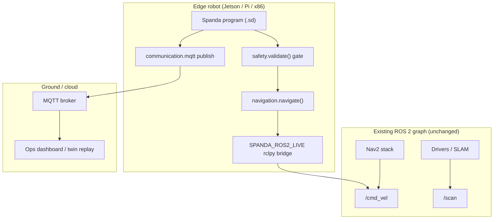

# MQTT + Nav2 reference architecture

End-to-end layout for a **Spanda coordination layer** on top of an existing ROS 2 + Nav2 stack, with
**live MQTT telemetry** to a ground station or cloud broker. Spanda orchestrates safety, missions,
and package-backed I/O; Nav2, drivers, and SLAM remain ROS 2 nodes.

**Related:** [ros2-golden-path.md](./ros2-golden-path.md) ·
[robotics-platform.md](./robotics-platform.md) · [tier-3-golden-paths.md](./tier-3-golden-paths.md)
· [autonomous_rover](../examples/showcase/autonomous_rover/)

---

## Architecture



| Layer | Responsibility | Spanda surface |
|-------|----------------|----------------|
| **Coordination** | Missions, modes, safety, verify | `robot`, `mission`, `safety`, `verify` |
| **Navigation** | Goals, paths, cmd_vel stubs | `std.navigation`, `navigate { }` |
| **ROS 2 bridge** | Live `/cmd_vel`, `/scan` | `topic` + `SPANDA_ROS2_LIVE=1` |
| **Telemetry** | Status to broker | `bus` + `topic` + `SPANDA_LIVE_MQTT=1` |
| **Packages** | GPS, Wi-Fi, nav adapters | `spanda.toml` + provider dispatch |

Spanda does **not** replace Nav2 planners, costmaps, or ROS 2 lifecycle — it publishes validated
motion intent and subscribes to sensor topics through the bridge.

---

## Reference programs

| Program | Role |
|---------|------|
| [nav2_bridge.sd](../examples/robotics/nav2_bridge.sd) | Minimal Nav2 golden path — `navigation.navigate()` → `/cmd_vel` |
| [mqtt_live.sd](../examples/communication/mqtt_live.sd) | Live Mosquitto pub/sub (`mqtt-golden-path` CI) |
| [autonomous_rover](../examples/showcase/autonomous_rover/) | Flagship: GPS, MQTT, Wi-Fi packages + patrol behavior |
| [world_model_patrol.sd](../examples/showcase/world_model_patrol.sd) | Observe → fusion → belief-gated motion |

---

## Build and validate (local)

```bash
cargo build -p spanda-cli --release --features live-mqtt,live-transport
export PATH="$PWD/target/release:$PATH"

# Type-check reference stack
spanda check examples/robotics/nav2_bridge.sd
spanda check examples/communication/mqtt_live.sd
spanda check examples/showcase/autonomous_rover/src/rover.sd

# Golden paths (no ROS distro required for MQTT)
./scripts/mqtt_golden_path.sh
./scripts/world_model_golden_path.sh
```

### Live ROS 2 + Nav2 (manual)

```bash
source /opt/ros/humble/setup.bash
export SPANDA_ROS2_LIVE=1
spanda run examples/robotics/nav2_bridge.sd
# Terminal A: ros2 topic echo /cmd_vel
```

See [ros2-golden-path.md](./ros2-golden-path.md) for full `/cmd_vel` and `/scan` validation.

### Live MQTT

```bash
mosquitto -p 1883 &
export SPANDA_LIVE_MQTT=1
spanda sim examples/communication/mqtt_live.sd
# Or: ./scripts/mqtt_golden_path.sh
```

---

## Combined deployment pattern

Typical field robot program structure:

```spanda
import positioning.gps;
import communication.mqtt;

robot FieldRover {
  topic cmd_vel: Velocity publish on "/cmd_vel";
  sensor lidar: Lidar on "/scan";
  actuator wheels: DifferentialDrive;

  bus telemetry {
    transport: "mqtt";
    url: "mqtt://broker.local:1883";
  }

  topic status: String publish on "/fleet/rover/status";

  mission Patrol { navigate; scan; return_home; }

  safety {
    max_speed = 0.5 m/s;
    stop_if lidar.nearest_distance < 0.4 m;
  }

  behavior patrol() {
    navigation.goal("Waypoint A");
    navigate { goal: "Waypoint A"; linear: 0.2 m/s; angular: 0.0 rad/s; }
    publish status with "patrol_ok";
  }
}
```

Runtime env for a combined stack:

| Variable | Purpose |
|----------|---------|
| `SPANDA_ROS2_LIVE=1` | rclpy bridge for declared ROS topics |
| `SPANDA_LIVE_MQTT=1` | Live MQTT publish/subscribe |
| `SPANDA_NAV2_CMD` | Optional external Nav2 subprocess hook |

Package imports resolve through `spanda.toml` → lock → vendor → provider registry
([how-runtime-resolution-works.md](./how-runtime-resolution-works.md)).

---

## CI coverage

| Job | Script | Validates |
|-----|--------|-----------|
| `mqtt-golden-path` | [mqtt_golden_path.sh](../scripts/mqtt_golden_path.sh) | Live Mosquitto pub/sub |
| `robotics-golden-path` | [golden_path_deploy.sh](../examples/robotics/golden_path_deploy.sh) | Fleet + deploy |
| `world-model-golden-path` | [world_model_golden_path.sh](../scripts/world_model_golden_path.sh) | Fusion → belief hook |

ROS 2 live validation remains **manual** until the P0 ROS2 golden-path CI job lands
([tier-3-priority-plan.md](./tier-3-priority-plan.md)).

---

## Incident and replay

Record mission traces during sim or field runs, export twin JSON, and optionally upload for
post-incident review:

```bash
spanda sim examples/showcase/autonomous_rover/src/rover.sd --record
spanda twin export examples/communication/twin_replay_golden.sd --out incident-replay.json
```

Workflow details: [replay.md](./replay.md).

---

## Next steps (Phase 24+)

- Single showcase wiring **Nav2 bridge + MQTT telemetry + world_model belief** in one deployable
  example
- ROS2 golden-path CI job with sourced Humble in GitHub Actions
- LLVM native binaries for Jetson/Pi targets —
  [llvm-embedded-benchmark.md](./llvm-embedded-benchmark.md)
