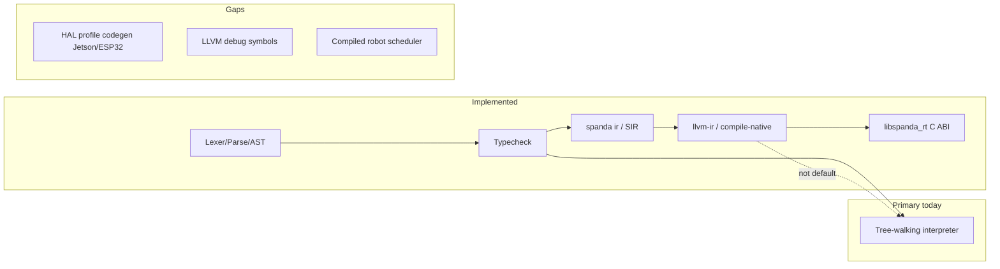

# Roadmap & Codebase Gap Audit (June 2026)

**Audit date:** 2026-06-22  
**Release line:** v0.4.0  
**Scope:** All roadmap documents vs. implementation, examples, registry, CI, and TypeScript mirror.

Canonical status for ongoing release decisions remains [`feature-status.md`](./feature-status.md). This file captures a point-in-time audit and closure tracking.

---

## Closure status (post-audit)

Gap-closure work landed on `main` in commits `1eaefab`–`0ddde26` (2026-06-22).

| Finding | Status |
|---------|--------|
| Registry index lag (20 → 29 packages) | **Closed** — `registry/index.json` lists all scaffolds |
| `spanda demo rover` missing bundled `autonomous_rover` | **Closed** — bundled source in `crates/spanda-cli/bundled-examples/` |
| No `phase30_gaps.rs` | **Closed** — health-polling test extracted from `phase29_verification.rs` |
| README v0.3/v0.4 contradiction | **Closed** |
| Phase 25 “In progress” in lean-core roadmap | **Closed** — Complete ✓ (Marketplace partial) |
| `feature-status` / `getting-started` v0.1.0-alpha labels | **Closed** — aligned to v0.4 |
| `product-strategy` stale header / world models | **Closed** |
| `roadmap.md` native deploy **Stable** vs feature-status **Experimental** | **Closed** |
| Phase 27+ missing from `spanda-language.md` | **Closed** — verification/health/kill-switch section added |
| Golden path live AI example path | **Closed** — `examples/features/live_openai.sd` |
| Orphan `examples/iot/modbus_dispatch/` directory | **Closed** — removed locally (canonical file: `modbus_dispatch.sd`) |
| VS Code Marketplace publish | **Open** — needs maintainer `VSCE_PAT` |
| `spanda-reference.md` Phase 27+ keywords | **Open** — not regenerated in this pass |
| TypeScript CLI `--verification-json` | **Open** — LSP uses native CLI |
| TS integration tests for Phase 27+ syntax | **Open** |
| Per-protocol IoT standalone `.sd` examples | **Open** — only `modbus_dispatch.sd` today |
| `agent_can_deny.sd` in golden/CI smoke | **Open** |
| Hardware adapter trait codegen | **Future** (correctly deferred) |
| Twin cloud SaaS product | **Future** |
| LLVM as primary runtime | **Future** |

---

## Executive summary

The **implementation is ahead of several roadmaps** (Phases 27–35, most P0/P1 golden paths, v0.4 deploy/ROS2/fleet docs). At audit time the main gaps were **documentation drift**, **one product blocker** (VS Code Marketplace), **registry index lag** (9 scaffolds not in `index.json`), and **reference-doc holes** (`spanda-language.md`, `spanda-reference.md`, TS CLI parity for `--verification-json`).

Most P0/P1 doc and registry gaps are now closed (see table above). Remaining work is Marketplace publish, reference regeneration, TS mirror polish, and thin example coverage for IoT protocols.

---

## Roadmap documents compared

| Document | Scope | Alignment with code (at audit) |
|----------|--------|-------------------------------|
| [`docs/roadmap.md`](./roadmap.md) | Version plan (v0.2–v0.4, v1.0) | **Mostly accurate** — v0.4 items exist; “Stable” was optimistic for LLVM/native deploy (since fixed) |
| [`docs/lean-core-roadmap.md`](./lean-core-roadmap.md) | Phases 1–35 crate/DX work | **Phases 27–35 match code**; Phase 25 was “In progress” though all steps except Marketplace were done (since fixed) |
| [`docs/compiler-backend-roadmap.md`](./compiler-backend-roadmap.md) | SIR → LLVM → native | **Milestones 1–2 implemented**; interpreter remains primary; HAL cross-compile still partial |
| [`docs/product-strategy.md`](./product-strategy.md) | Positioning + v0.5/v1.0 | **Stale header** at audit (v0.1.0-alpha); v0.5 P0 table accurate except Marketplace |
| [`docs/tier-3-priority-plan.md`](./tier-3-priority-plan.md) | P0–P4 ordering | **P0 #1 partial**; P1 complete; P2-A items done in CI but table has no “Complete” column |
| [`docs/tier-3-golden-paths.md`](./tier-3-golden-paths.md) | CI scripts index | **Accurate**; Phase 25 footer and live AI example path were stale (since fixed) |
| [`docs/feature-status.md`](./feature-status.md) | Truth table | **Good content** but mixed version labels at audit (since fixed) |

---

## Version roadmap vs codebase

### v0.4 — Deploy path (current)

| Claimed | Code reality | Gap (at audit) |
|---------|--------------|----------------|
| `spanda deploy --target native` | `crates/spanda-cli/src/main.rs` → `compile_native` | **PARTIAL** — works with `clang`; interpreter is primary; tier now **Experimental** in both roadmaps |
| `spanda compile-native` + LLVM CI | `scripts/llvm_golden_path.sh`, `llvm-embedded-golden_path.sh`, CI jobs | **IMPLEMENTED** (experimental, not default runtime) |
| `spanda ros2 check` | `crates/spanda-cli/src/ros2_cli.rs` | **IMPLEMENTED** |
| Distributed fleet guide | `docs/fleet-distributed.md`, `fleet orchestrate --remote` | **IMPLEMENTED** (HTTP agents, not full distributed runtime) |
| ROS2 rclpy golden path | `scripts/ros2_golden_path.sh` | **EXPERIMENTAL** (correct in roadmap) |
| Hardware adapter trait codegen | — | **MISSING** (Future — correct) |
| Twin cloud SaaS | `scripts/twin_cloud_golden_path.sh` only | **MISSING product** (Future — correct) |

### v0.3 / v0.2 — Tooling & onboarding

| Claimed | Reality | Gap (at audit) |
|---------|---------|----------------|
| `cargo install spanda` | Crate `spanda` in `crates/spanda-cli/Cargo.toml` | **IMPLEMENTED** |
| `spanda demo {rover,safety,verify,fleet,health}` | `crates/spanda-cli/src/demo_cli.rs` | **PARTIAL** — `demo rover` needed bundled `autonomous_rover` (since fixed) |
| LSP SafeAction quick-fix | `packages/lsp/src/server.ts` | **IMPLEMENTED** |
| VS Code snippets | `editor/vscode/snippets/spanda.json` | **IMPLEMENTED** |
| Live IoT golden path CI | `.github/workflows/ci.yml` `live-iot-golden-path` | **IMPLEMENTED** |
| mdBook / docs site | `docs-site/`, Pages workflow | **IMPLEMENTED** |

### v0.5 beta (product-strategy / tier-3 P0)

| P0 item | Status (at audit) | Notes |
|---------|---------------------|-------|
| VS Code Marketplace publish | **PARTIAL** | CI + `VSCE_PAT` in `release.yml`; listing blocked without maintainer secret |
| Killer demo | **DONE** | — |
| Live AI path | **DONE** | OpenAI, Anthropic, ONNX (Phases 33–35) |
| ROS2 golden path | **DONE** | — |
| Hosted registry | **DONE** | Was 20 in index; 9 scaffolds on disk but not indexed (since fixed → 29) |

### v1.0 / Future (all roadmaps agree)

| Item | Code | Gap |
|------|------|-----|
| LLVM as primary runtime | Interpreter default | **PLANNED** |
| Self-hosting compiler (full) | `examples/self_host/lexer_keywords.sd` + golden path | **BOOTSTRAP ONLY** |
| Formal verification | — | **MISSING** |
| Native Rust OPC-UA | Python bridge only | **MISSING** (bridge path exists) |
| Production blockchain | `MockLedgerBackend` | **STUB** |
| Full world models | Minimal `world_model` buffer | **PARTIAL** — product-strategy updated to “minimal runtime” |

---

## Lean-core Phases 1–35 vs codebase

Phases **27–35** are backed by code and tests:

| Phase | Test file | Notes |
|-------|-----------|-------|
| 28 | `p1_features.rs` | `expect_compile_error`, module return types |
| 29 | `phase29_verification.rs` | Kill switch verification + runtime trigger |
| 30 | `phase30_gaps.rs` | Health polling during trigger loop (added post-audit) |
| 31–35 | `phase31_gaps.rs` … `phase35_gaps.rs` | All present |

**Examples vs phases:** Audit added 12+ examples for Phase 27–35; remaining thin spots:

- Per-protocol IoT `.sd` examples (only `modbus_dispatch.sd`; zigbee/lora/matter/canbus/opcua lack standalone examples)
- `agent_can_deny.sd` — runtime denial not in golden/CI smoke

---

## Compiler backend roadmap vs code

| Milestone | Roadmap says | Code says |
|-----------|--------------|-----------|
| SIR export | ✓ | `spanda ir` works |
| LLVM IR + `compile-native` | ✓ | `spanda-llvm`, needs `clang` |
| Cross-compile HAL | Partial | `--target-triple` exists; Jetson/ESP32 profiles **not** production-ready |
| Interpreter retirement | Future | Correct — verify/sim/AI still interpreter-backed |

---

## Documentation & roadmap drift (audit findings)

These were **gaps between docs**, not missing features. Most are closed (see closure table).

| Issue | Where | Status |
|-------|--------|--------|
| README **v0.4 current** but **“Next (v0.3)”** / **“v0.4: LLVM”** as future | [`README.md`](../README.md) | **Closed** |
| README **Phases 1–35** vs architecture **Phases 1–17** | Same file | **Closed** (README) |
| `feature-status` header **v0.4** but sections **v0.1.0-alpha** | [`feature-status.md`](./feature-status.md) | **Closed** |
| `product-strategy` **Last updated: post v0.1.0-alpha** | [`product-strategy.md`](./product-strategy.md) | **Closed** |
| `language-capabilities-audit.md` archived at **v0.1.0-alpha** | Points to v0.4 target | **Closed** |
| `getting-started` / tutorials **v0.1.0-alpha** labels | [`getting-started.md`](./getting-started.md) | **Closed** (getting-started) |
| Phase 27+ syntax missing from language reference | [`spanda-language.md`](./spanda-language.md) | **Closed** (section added) |
| `spanda-reference.md` keywords | [`spanda-reference.md`](./spanda-reference.md) | **Open** |
| `roadmap.md` native deploy **Stable** vs `feature-status` **Experimental** | Tier mismatch | **Closed** |

---

## TypeScript mirror gaps

| Feature | Rust | TypeScript |
|---------|------|------------|
| Parser: kill_switch, health_check, expect_compile_error | ✓ | ✓ (`src/parser/index.ts`) |
| `spanda check --verification-json` | ✓ CLI | **MISSING** in `src/cli/index.ts` (LSP calls native CLI) |
| Phase 27–35 integration tests | `phase*_gaps.rs` | **Only** `tests/capability-parser.test.ts` |
| `npm run build` / `tsc` | N/A | ✓ (Phase 35) |

---

## Registry & packages

| | Count (post-closure) |
|--|----------------------|
| `packages/registry/` scaffolds | **29** |
| `registry/packages/` tarballs | **29** |
| `registry/index.json` entries | **29** |

Rebuild after adding scaffolds: `./scripts/build-registry.sh` (tarballs + `registry-index-maintain` signatures).

---

## CI / test coverage

| Area | CI | Dedicated tests | Gap |
|------|-----|-----------------|-----|
| Phase 27–35 | Partial via golden paths | `phase29`–`phase35` | `phase30_gaps.rs` added |
| Live IoT bridges | `live-iot-golden-path` | `phase35_gaps` env gates | Bridge mocks only, not hardware |
| VS Code extension | `vscode-extension-ci` + release VSIX | `verify_vscode_vsix.sh` | Marketplace blocked on `VSCE_PAT` |
| Showcase demos | `showcase_smoke.sh` | — | Rover demo bundled |
| Example regression | `check_all_examples.sh` | — | New Phase 27–35 examples in tree |

---

## Prioritized gap closure (original plan)

### P0 — Product / credibility

1. **VS Code Marketplace publish** — set `VSCE_PAT`; only open P0 blocker across all roadmaps. **Still open.**
2. **Sync version narrative** — README, `feature-status`, `product-strategy`, `getting-started` → single **v0.4.0** story. **Done.**
3. **Mark Phase 25 complete** in `lean-core-roadmap.md` (footnote: Marketplace partial). **Done.**

### P1 — Docs & discoverability

4. **Extend** `spanda-language.md` with Phase 27+ keywords. **Done.** Regenerate `spanda-reference.md` — **open**.
5. **Index 9 registry scaffolds** via `./scripts/build-registry.sh` + commit. **Done.**
6. **Bundle `autonomous_rover`** for `spanda demo rover`. **Done.**

### P2 — Engineering polish

7. **Add `phase30_gaps.rs`**. **Done.**
8. **TS tests** for `expect_compile_error`, fleet `require`, `on kill_switch`. **Open.**
9. **IoT example coverage** — thin `.sd` stubs for opcua/zigbee/lora/matter/canbus. **Open.**
10. **Align tier labels** for native deploy/LLVM. **Done.**

### P3 — Future (correctly deferred)

- Hardware adapter trait codegen  
- Twin cloud SaaS backend  
- Formal verification integration  
- Native OPC-UA crate  
- LLVM as primary runtime  
- Full self-hosting compiler  

---

## Bottom line

**Codebase:** Phases 1–35 and v0.4 deploy/ROS2/fleet/tooling claims are largely **implemented**; the interpreter-first runtime and experimental LLVM/native deploy are honestly **partial**, not production-primary.

**Roadmaps:** The largest gaps at audit were **stale cross-references**, **one external blocker** (Marketplace), **registry index lag**, and **language-reference holes** — not missing core language features from Phases 27–35. Doc/registry/bundled-demo closure is complete; Marketplace, `spanda-reference.md` regeneration, and TS mirror tests remain.

---

## Related

- [`feature-status.md`](./feature-status.md) — current Stable / Experimental / Planned matrix
- [`roadmap.md`](./roadmap.md) — version plan
- [`lean-core-roadmap.md`](./lean-core-roadmap.md) — Phases 1–35 detail
- [`language-capabilities-audit.md`](./language-capabilities-audit.md) — archived June 2025 audit (superseded for release decisions by this file + feature-status)
